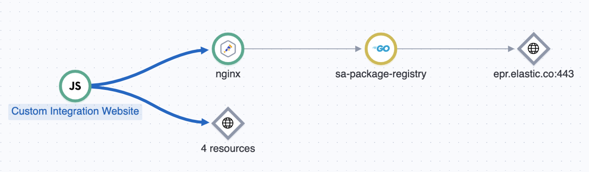

# Integrating Nginx with OpenTelemetry on Debian

##  1. <a name='TableofContent'></a>Table of Content

<!-- vscode-markdown-toc -->
* 1. [Table of Content](#TableofContent)
* 2. [Why Integrate Nginx with OpenTelemetry?](#WhyIntegrateNginxwithOpenTelemetry)
* 3. [Installation on Debian](#InstallationonDebian)
	* 3.1. [Prerequisites](#Prerequisites)
	* 3.2. [Load the Module in Nginx](#LoadtheModuleinNginx)
* 4. [Configuration](#Configuration)
	* 4.1. [Global Configuration (`/etc/nginx/nginx.conf`)](#GlobalConfigurationetcnginxnginx.conf)
	* 4.2. [Server Block Configuration (`/etc/nginx/conf.d/site.conf`)](#ServerBlockConfigurationetcnginxconf.dsite.conf)
* 5. [Reference](#Reference)

<!-- vscode-markdown-toc-config
	numbering=true
	autoSave=true
	/vscode-markdown-toc-config -->
<!-- /vscode-markdown-toc -->


This guide provides a comprehensive overview of why, how to install, and how to configure the Nginx OpenTelemetry (OTEL) module on a Debian-based system. The configuration examples are tailored to send telemetry data directly to an Elastic APM endpoint, enabling end-to-end distributed tracing.

##  2. <a name='WhyIntegrateNginxwithOpenTelemetry'></a>Why Integrate Nginx with OpenTelemetry?

Nginx often acts as the entry point for all traffic to your applications (a reverse proxy, API gateway, or load balancer). Instrumenting it is critical for achieving complete visibility into your system's behavior. Without it, you have a significant blind spot.

Key benefits include:

*   **End-to-End Distributed Tracing:** This is the primary goal. When a request comes from a browser with a trace context (from a RUM agent), the Nginx OTEL module can continue that trace. It then propagates the trace context to your backend services. This allows you to see a single, unified trace that spans from the user's click in the browser, through your Nginx proxy, to the final response from your backend application.
*   **Performance Monitoring:** You can precisely measure the latency introduced by Nginx itself. This helps answer questions like: Is a slow response due to the backend application, or is it because of network latency or processing overhead within Nginx?
*   **Error Analysis:** The module captures errors that occur at the Nginx layer, such as `502 Bad Gateway` or `504 Gateway Timeout`. These are critical errors that your backend service might not even be aware of, but they directly impact the user experience.
*   **Accurate Service Maps:** For APM tools to automatically generate a Service Map, they need to understand the connections between services. By instrumenting Nginx, you provide the necessary data to draw the connections from the frontend to Nginx, and from Nginx to your backend services.

Output example:



##  3. <a name='InstallationonDebian'></a>Installation on Debian

The Nginx OTEL module is included in the standard Nginx packages. It must need to be installed along with a working nginx configuration.

###  3.1. <a name='Prerequisites'></a>Prerequisites

First, install the necessary tools for compiling software and the Nginx development dependencies.

```bash
sudo apt update
sudo apt install -y apt install nginx-module-otel
```

###  3.2. <a name='LoadtheModuleinNginx'></a>Load the Module in Nginx

Finally, edit your main `/etc/nginx/nginx.conf` file to load the new module. This directive must be at the top level, before the `http` block.

```nginx
# /etc/nginx/nginx.conf

load_module modules/ngx_otel_module.so;

events {
    # ...
}

http {
    # ...
}
```

Now, test your configuration and restart Nginx.

```bash
sudo nginx -t
sudo systemctl restart nginx
```

##  4. <a name='Configuration'></a>Configuration

Configuration is split between the main `nginx.conf` file (for global settings) and your site-specific server block files.

###  4.1. <a name='GlobalConfigurationetcnginxnginx.conf'></a>Global Configuration (`/etc/nginx/nginx.conf`)

This configuration sets up the destination for your telemetry data and defines global variables used for CORS and tracing. These settings are placed inside the `http` block.

```nginx
http {
    include       /etc/nginx/mime.types;
    default_type  application/octet-stream;
    log_format  main  '$remote_addr - $remote_user [$time_local] "$request" '
                      '$status $body_bytes_sent "$http_referer" '
                      '"$http_user_agent" "$http_x_forwarded_for"';
    access_log  /var/log/nginx/access.log  main;

    # --- OpenTelemetry Exporter Configuration ---
    # Defines where Nginx will send its telemetry data directly to Elastic APM.
    otel_exporter {
        endpoint https://<ELASTIC_URL>:443;
        header Authorization "Bearer <TOKEN>";
    }

    # --- OpenTelemetry Service Metadata ---
    # These attributes identify Nginx as a unique service in the APM UI.
    otel_service_name nginx;
    otel_resource_attr service.version 1.28.0;
    otel_resource_attr deployment.environment production;
    otel_trace_context propagate; # Needed to propagate the RUM traces to the backend

    map_hash_bucket_size 128;

    # --- Helper Variables for Tracing and CORS ---
    # Creates the $trace_flags variable needed to build the outgoing traceparent header.
    map $otel_parent_sampled $trace_flags {
        default "00"; # Not sampled
        "1"     "01"; # Sampled
    }

    # Creates the $cors_origin variable for secure, multi-origin CORS handling.
    map $http_origin $cors_origin {
        default "";
        "http://<URL_ORIGIN_1>/" $http_origin; # Add your Origin here to allow CORS
        "https://<URL_ORIGIN_2>/" $http_origin; # Add your others Origin here to allow CORS
    }
    
    sendfile        on;
    keepalive_timeout  65;
    include /etc/nginx/conf.d/*.conf;
}
```

###  4.2. <a name='ServerBlockConfigurationetcnginxconf.dsite.conf'></a>Server Block Configuration (`/etc/nginx/conf.d/site.conf`)

This configuration enables tracing for a specific site, handles CORS preflight requests, and propagates the trace context to the backend service.

```nginx
server {
    listen 443 ssl;
    server_name <WEBSITE_URL>;

    # SSL Configuration (managed by Certbot)
    ssl_certificate /etc/letsencrypt/live/<WEBSITE_URL>/fullchain.pem;
    ssl_certificate_key /etc/letsencrypt/live/<WEBSITE_URL>/privkey.pem;
    include /etc/letsencrypt/options-ssl-nginx.conf;
    ssl_dhparam /etc/letsencrypt/ssl-dhparams.pem;

    # Enable tracing for this server block.
    otel_trace on;
    otel_trace_context propagate;

    location / {
        # --- CORS Preflight (OPTIONS) Handling ---
        # Intercepts preflight requests and returns the correct CORS headers,
        # allowing the browser to proceed with the actual request.
        if ($request_method = 'OPTIONS') {
            add_header 'Access-Control-Allow-Methods' 'GET, POST, OPTIONS' always;
            add_header 'Access-Control-Allow-Headers' 'Content-Type, traceparent, tracestate' always;
            add_header 'Access-Control-Max-Age' 86400;
            add_header 'Access-Control-Allow-Origin' "$cors_origin" always;
            return 204;
        }

        # --- Standard Proxy Headers ---
        proxy_set_header Host             $host;
        proxy_set_header X-Real-IP        $remote_addr;
        proxy_set_header X-Forwarded-For  $proxy_add_x_forwarded_for;
        proxy_set_header X-Forwarded-Proto $scheme;

        # --- Trace Context Propagation ---
        # Manually constructs the W3C traceparent header and passes the tracestate
        # header to the backend, linking this trace to the upstream service.
        proxy_set_header traceparent      "00-$otel_trace_id-$otel_span_id-$trace_flags";
        proxy_set_header tracestate       $http_tracestate;

        # --- Forward to Backend ---
        # Passes the request to the actual application.
        proxy_pass http://localhost:8080;
    }
}

# HTTP to HTTPS redirect server
server {
    if ($host = <WEBSITE_URL>) {
        return 301 https://$host$request_uri;
    }
    listen 80;
    server_name <WEBSITE_URL>;
    return 404;
}
```

##  5. <a name='Reference'></a>Reference

For more detailed information on all available directives and variables, consult the official documentation for the Nginx OpenTelemetry module.

*   **Official Documentation:** [https://nginx.org/en/docs/ngx_otel_module.html](https://nginx.org/en/docs/ngx_otel_module.html)
